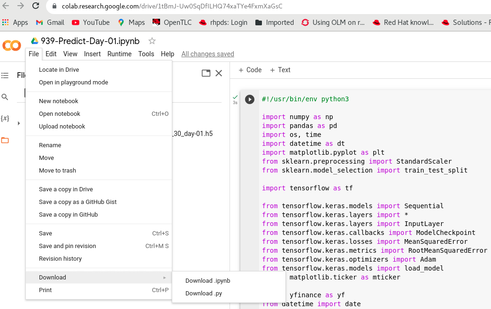

# run-jupyter-notebook-in-container

echo "# run-jupyter-notebook-in-container" >> README.md
git init
git add README.md
git commit -m "first commit"
git branch -M main
git remote add origin https://github.com/alpha-wolf-jin/run-jupyter-notebook-in-container.git

git config --global credential.helper 'cache --timeout 72000'

git push -u origin main

git add . ; git commit -a -m "update README" ; git push -u origin main


# Manually convert notebook to .py script
The next approach is to manually convert Jupyter Notebook to Python .py script. Please click File->Download as->Python (.py):


Insert the **#!/usr/bin/env python3** as first line:
```
#!/usr/bin/env python3

# -*- coding: utf-8 -*-
"""939-Predict-Day-01.ipynb

Automatically generated by Colaboratory.

Original file is located at
    https://colab.research.google.com/drive/1tBmJ-Uw0SqDfILHQ74xaTYe4FxmXaGsC
"""
```
